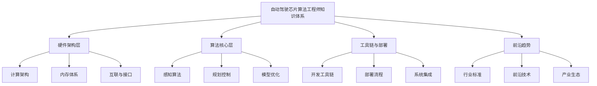

## 🚗 自动驾驶芯片算法工程师知识图谱

以下是按模块分类的知识体系：



---

### **一、硬件架构层（芯片视角）**

#### 1.1 计算架构
```
- CPU/GPU/NPU架构对比
- 专用计算单元设计
  • 卷积加速器（TPU/NVDLA）
  • 注意力机制加速器
  • 向量处理器（DSP）
- 多核异构调度策略
- 存算一体架构（PIM/CIM）
```

#### 1.2 内存体系
```
- 多层次存储设计（L1/L2/HBM）
- 带宽与延迟优化
- 数据流编排策略
- 稀疏数据压缩传输
```

#### 1.3 互联与接口
```
- 片上网络（NoC）设计
- Chiplet互联技术（UCIe）
- 高速接口（PCIe Gen5/6）
- 车载网络（CAN/Ethernet TSN）
```

---

### **二、算法核心层（模型视角）**

#### 2.1 感知算法
```
- 视觉Transformer优化
  • ViT量化部署方案
  • 轻量化注意力机制
- 多模态融合架构
  • BEVFormer芯片实现
  • 时序融合加速方案
- 激光雷达点云处理
  • 稀疏卷积加速技术
  • 体素化硬件加速
```

#### 2.2 规划控制
```
- 神经网络MPC加速
- 强化学习芯片部署
- 轨迹预测专用架构
- 安全约束计算加速
```

#### 2.3 模型优化
```
- 量化感知训练（QAT）
  • 混合精度策略（INT8/INT4/FP16）
  • 非均匀量化技术
- 模型压缩
  • 结构化剪枝硬件支持
  • 知识蒸馏部署优化
- 编译器优化
  • TVM/MLIR编译器栈
  • 算子融合策略
```

---

### **三、工具链与部署**

#### 3.1 开发工具链
```
- 主流芯片工具链对比
  • NVIDIA TensorRT
  • 华为昇腾CANN
  • 地平线BPU工具链
  • 寒武纪MagicMind
- 性能分析工具
  • 功耗分析（Power Artist）
  • 性能剖析（Nsight/Tracy）
```

#### 3.2 部署流程
```
- 模型转换与优化流水线
- 内存占用优化策略
- 实时性保障技术
  • 确定性调度
  • 最坏执行时间分析
```

#### 3.3 系统集成
```
- AUTOSAR AP/CP集成
- 功能安全（ISO 26262）
- 信息安全（ISO 21434）
```

---

### **四、前沿趋势**

#### 4.1 行业标准
```
- Open AD Kit标准进展
- MLPerf Automotive Benchmark
- 车规级芯片认证流程
```

#### 4.2 前沿技术
```
- 大模型端侧部署
  • 多模态大模型压缩
  • 推理时优化技术
- 光子计算与量子计算
- 神经拟态计算
```

#### 4.3 产业生态
```
- 主流芯片厂商技术路线
  • 英伟达Thor平台
  • 高通Ride Flex
  • Mobileye EyeQ6
  • 华为MDC平台
```

---

## 📅 学习计划建议

### **方案A：垂直深耕路线**（按技术栈深度）
```
step1：硬件架构 → 芯片微架构深度
step2：算法优化 → 量化/剪枝/编译优化
step3：部署实战 → 工具链/性能调优
```

### **方案B：横向扩展路线**（按应用场景）
```
step1：感知算法全栈优化
step2：规划控制计算加速
step3：端到端大模型部署
```

### **方案C：问题驱动路线**（按实际需求）
```
优先选择工作中最急需的2-3个方向
每个方向深入2周，产出解决方案
迭代优化，形成技术沉淀
```

---

